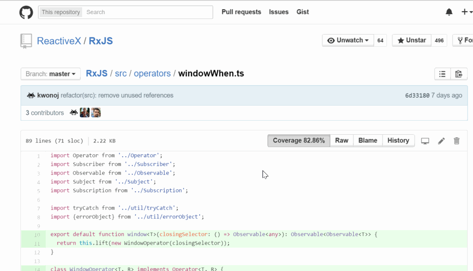

# coveralls-overlay

Chrome extension to overlay [coveralls](http://coveralls.io/) code coverage into github public repository covered by coveralls using [public api](https://coveralls.zendesk.com/hc/en-us/articles/201774865-API-Introduction)

* This extension is inspired by [codecov browser extension](https://github.com/codecov/browser-extension) and reused some of existing components.
* Icon resource comes from google's [material design icon](https://www.google.com/design/icons/#ic_visibility).
